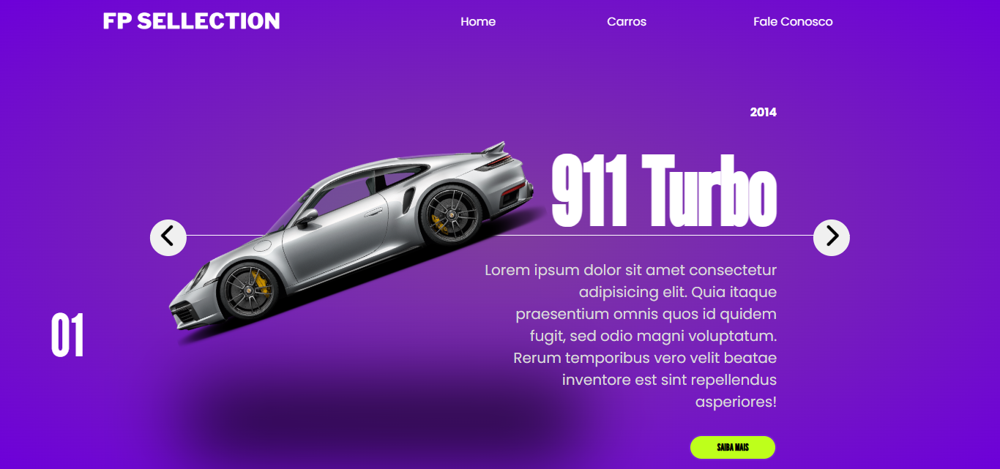

# 🚗 Slider de Carros

Projeto criado com o objetivo de estudo, explorando conceitos de HTML, CSS e JavaScript para construir um slider animado de carros inspirado em sites modernos de automóveis.

## 📌 Sobre o projeto

O Slide de carros é um carrossel interativo que exibe modelos esportivos com animações suaves, transições modernas e um layout responsivo.
Este projeto foi desenvolvido para treinar:

- Estruturação com HTML5

- Estilização avançada com CSS3

- Uso de variáveis CSS para animações

- Manipulação de classes e elementos via JavaScript

- Animações de entrada e saída de slides

- Controle de botões (next/prev)

- Sistema de indicadores dinâmicos

---

## 🎯 Objetivo

Este projeto foi desenvolvido somente para fins de estudo, praticando:

- animações com CSS;

- transições com transform e translate;

- carrosséis personalizados sem usar bibliotecas externas;

- organização de código e estruturação de layouts modernos.

## 📸 Prévia
### 🔥 Lamborghini

### ❤️ Ferrari

### ⚡ Porsche 911 Turbo

## 🧠 Aprendizados

Ao concluir este projeto, estudei:

- lógica de sliders;

- controle de índices ativos;

- delay de transições CSS coordenadas com JS;

- uso de propriedades personalizadas (--calculation);

### ✦ Desenvolvido por **Willian Matheus**  